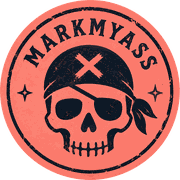

# MarkMyAss

**Proof, not promises.** Free open-source AI watermark, metadata &
provenance cleaner.

<br clear="left" />

[](https://github.com/bens777/MarkMyAss/pkgs/container/markmyass)

Website: **https://markmyass.com**
· Repository: **https://github.com/bens777/MarkMyAss**

Inspect → Clean → Verify → Download your cleaned file → Download a
Verification Receipt

## Quick start with Docker

**Docker → one command → http://127.0.0.1:8765**

The easiest way to run MarkMyAss locally -- no Python setup required, and
the independent verifiers ([ExifTool](https://exiftool.org/) and
[c2patool](https://github.com/contentauth/c2pa-rs)) come preinstalled in
the image.

### Run MarkMyAss

```bash
docker run -d --name markmyass \
  -p 127.0.0.1:8765:8765 \
  ghcr.io/bens777/markmyass:latest
```

Then open **http://127.0.0.1:8765**. The port is bound to `127.0.0.1`
only, so the UI is reachable from your own machine, never from your
network -- and nothing is uploaded anywhere.

### Stop MarkMyAss

```bash
docker stop markmyass
```

### Start it again

```bash
docker start markmyass
```

### Remove it

```bash
docker rm -f markmyass
```

### Update to the latest version

```bash
docker rm -f markmyass
docker pull ghcr.io/bens777/markmyass:latest
docker run -d --name markmyass -p 127.0.0.1:8765:8765 ghcr.io/bens777/markmyass:latest
```

### Build the Docker image from source

Prefer to build the image yourself instead of pulling from GHCR?

```bash
git clone https://github.com/bens777/MarkMyAss.git
cd MarkMyAss
docker build -t markmyass:local .
docker run -d --name markmyass -p 127.0.0.1:8765:8765 markmyass:local
```

(The first build takes a few minutes: c2patool is compiled from source in
a throwaway build stage. See "Docker: building the image yourself" below
for the `docker compose` variant.)

Don't want Docker? See "Run MarkMyAss locally" below for the from-source
and double-click options, or use the hosted version at
https://markmyass.com with zero installation.

MarkMyAss inspects files and text for hidden Unicode characters, embedded
metadata, and provenance signals, removes the ones it can safely remove,
and then independently re-verifies its own output -- with MarkMyAss's own
native detectors *and*, where applicable, [ExifTool](https://exiftool.org/)
and [c2patool](https://github.com/contentauth/c2pa-rs) -- so it can tell
you what actually changed, with evidence, not vibes. No fake "100%
undetectable" scores: a signal is only ever reported `VERIFIED CLEAN`
when an independent tool agrees, and every claim MarkMyAss makes about a
watermark or provenance mechanism is documented, sourced, and dated at
[**/lab**](https://markmyass.com/lab), the AI Watermark Lab.

> **Naming note:** MarkMyAss is powered by the **GhostMark engine**. The
> Python package and CLI command remain `ghostmark` for compatibility --
> so you'll type `ghostmark inspect ...` and see "GhostMark" in CLI
> output, while the product, website and documentation are MarkMyAss.

## Use MarkMyAss online

```text
https://markmyass.com
```

No installation. Free, open source tool by [Moseisley.sh](https://moseisley.sh).
Files are processed temporarily on the server and deleted automatically
-- see "Privacy" below for exactly what that means.

## Run MarkMyAss locally

The Docker quick start above is the recommended local setup. If you'd
rather not use Docker (or want to hack on the code), run from source:

```bash
git clone https://github.com/bens777/MarkMyAss.git
cd MarkMyAss
pip install -e .

ghostmark demo     # generates synthetic fixtures and proves the pipeline works
ghostmark ui       # opens http://127.0.0.1:8765 -- 100% local, nothing uploaded
```

Or from the CLI directly:

```bash
ghostmark inspect document.pdf
ghostmark clean document.pdf
ghostmark verify document.ghostmark.pdf
```

Both the hosted site and the local tool run the exact same open-source
code. The only difference is where processing happens -- see
[`PRIVACY.md`](PRIVACY.md) for the precise distinction.

Not comfortable with a terminal? Double-click, instead of the `pip
install` step above:

- **Windows:** `START-MARKMYASS.bat` (or `START-MARKMYASS.ps1`)
- **Linux / macOS:** `start-markmyass.sh`

These scripts check for Python, set up a virtual environment, install
MarkMyAss, and open the local web UI for you -- with plain-language
errors if something's missing. (The former `START-GHOSTMARK` /
`start-ghostmark.sh` names still work as compatibility wrappers.)

---

## Why MarkMyAss is honest about what "AI watermark" means

"AI watermark" gets used for at least seven different things. MarkMyAss
treats them as genuinely separate mechanisms, because they are:

1. **Hidden Unicode characters** -- zero-width spaces, Unicode "tag"
   steganography, bidi control marks, etc.
2. **Formatting artifacts** -- unusual whitespace, odd normalization.
3. **EXIF / XMP / document metadata** -- camera/tool/author info embedded
   in images and PDFs.
4. **C2PA / Content Credentials provenance metadata** -- a structured,
   embeddable manifest describing content origin.
5. **Embedded file-level provenance structures** -- the JUMBF containers
   C2PA (and similar schemes) are packaged in.
6. **Statistical / model-level text watermarks** -- a bias in how an LLM
   samples tokens, detectable (in principle) only by the provider with
   their private detection key.
7. **Visible image watermarks** -- a logo or text baked into the pixels.

MarkMyAss **detects and cleans 1-5** to varying degrees (see the table
below). It does **not** implement 6 or 7 in this release, and says so
plainly in its own output rather than pretending otherwise. If MarkMyAss
can't verify something, it reports `UNKNOWN` or `UNVERIFIED` -- never a
fabricated result.

## Learn how to run models locally

Cleaning metadata after the fact is one path; avoiding provider-side
provenance **at the source** is another. MarkMyAss's web UI includes a
practical developer guide covering hosted-vs-open-weight models, a
hardware/budget decision matrix, current recommended open-weight models
(coding, general reasoning, lightweight), local inference tools (Ollama,
llama.cpp, vLLM, LM Studio), and when renting a GPU beats buying one.

```text
https://markmyass.com/run-ai-locally
```

Locally, the same page is available at `http://127.0.0.1:8765/run-ai-locally`
once you've run `ghostmark ui`. Source: [`src/ghostmark/web/content/run_local.md`](src/ghostmark/web/content/run_local.md).

## The AI Watermark Lab and benchmarks

`/lab` is a public capability matrix -- for every signal MarkMyAss knows
about, whether it can detect it, remove it, and independently verify the
removal, its current status, and when it was last checked. Individual
pages go deeper on specific mechanisms:

- [`/lab/claude-watermark`](https://markmyass.com/lab/claude-watermark)
  -- separates file/metadata provenance, hidden Unicode, and statistical
  model-level watermarking, three genuinely different things people mean
  by "Claude watermark."
- [`/lab/c2pa`](https://markmyass.com/lab/c2pa) -- what MarkMyAss's
  heuristic JUMBF-container scan can and can't tell you, and why that's
  not the same as cryptographic C2PA manifest validation.
- [`/lab/hidden-unicode`](https://markmyass.com/lab/hidden-unicode)
  and [`/lab/pdf-metadata`](https://markmyass.com/lab/pdf-metadata).

Every Lab page ends with "Something outdated or inaccurate? Open an issue
or submit a pull request" and a "Last reviewed" date -- see
[`CONTRIBUTING.md`](CONTRIBUTING.md) for how to update the underlying
data (`src/ghostmark/web/lab_data.py`). Machine-readable version:
`GET /api/lab/status`.

[`/benchmarks`](https://markmyass.com/benchmarks) is generated
from a reproducible, synthetic-only test corpus
(`src/ghostmark/corpus/`) -- not hand-written. It runs MarkMyAss's real
inspect → clean → inspect → independently-verify pipeline against every
fixture and reports the actual pass/fail counts, including any known
failures (nothing is hidden). Machine-readable version:
`GET /api/benchmarks`.

## Task-specific pages

Each of these targets a genuinely distinct question, not the same page
with a keyword swapped in -- see [`/lab`](https://markmyass.com/lab)
for the underlying methodology any of them link back to:

- [`/claude-watermark-remover`](https://markmyass.com/claude-watermark-remover)
- [`/claude-watermark-detector`](https://markmyass.com/claude-watermark-detector)
- [`/ai-watermark-remover`](https://markmyass.com/ai-watermark-remover)
- [`/ai-metadata-cleaner`](https://markmyass.com/ai-metadata-cleaner)
- [`/c2pa-remover`](https://markmyass.com/c2pa-remover)
- [`/content-credentials-remover`](https://markmyass.com/content-credentials-remover)
- [`/hidden-unicode-remover`](https://markmyass.com/hidden-unicode-remover)

Content for these lives under
[`src/ghostmark/web/content/`](https://github.com/bens777/MarkMyAss/tree/main/src/ghostmark/web/content)
as plain Markdown, same pattern as the Lab pages. `/robots.txt`,
`/sitemap.xml` and `/llms.txt` are generated from the same canonical list
of indexable pages the test suite checks against (`INDEXABLE_PAGES` in
[`src/ghostmark/web/app.py`](src/ghostmark/web/app.py)) -- none of them
ever lists a session/download/API route.

## The web UI

```text
MarkMyAss
Free AI Metadata & Provenance Cleaner

[ Paste Text ]  [ Upload File ]

---------------------------------
STEP 1 — INSPECTION

Document metadata       FOUND
XMP metadata             NOT FOUND
EXIF metadata             FOUND
Hidden Unicode              NOT FOUND
C2PA / provenance            NOT FOUND
Statistical watermark          UNKNOWN

[ Clean File ]
---------------------------------
STEP 2 — CLEANING

Document metadata      REMOVED
EXIF metadata            REMOVED
Original file               PRESERVED

[ Verify Independently ]
---------------------------------
STEP 3 — INDEPENDENT VERIFICATION

Verified with ExifTool 13.x
✓ No embedded metadata found

GhostMark verification:  PASS
ExifTool verification:   PASS
c2patool verification:   PASS
Overall:                  VERIFIED CLEAN

Statistical AI watermark: NOT CURRENTLY VERIFIABLE

[ Download Clean File ]  [ Download Verification Receipt: JSON / HTML / TXT ]
```

Locally, the server binds to `127.0.0.1` only -- never reachable from
other devices, nothing uploaded anywhere. The hosted deployment is only
reachable through its reverse proxy (see `DEPLOY_MOSEISLEY.md`).

Verification always re-runs MarkMyAss's own native detectors on the
cleaned output *and*, if [ExifTool](https://exiftool.org/) and/or
[c2patool](https://github.com/contentauth/c2pa-rs) are installed,
independently cross-checks it with those separate, widely trusted tools --
so you don't have to take MarkMyAss's own word for it. MarkMyAss can
never award itself **VERIFIED CLEAN**: that verdict requires at least one
available, applicable external verifier to agree. Disagreement is
reported as **PARTIAL**; no verifier able to run at all is **UNVERIFIED**;
nothing to check is **NOT APPLICABLE**; a failure in MarkMyAss's own
cleaning is **FAILED** -- never inflated. See
[`/lab`](https://markmyass.com/lab) for what "independent
verification" actually means per signal. Downloading the cleaned file
serves it with `Content-Disposition: attachment` and a name like
`document.ghostmark.pdf`; you can also download a Verification Receipt
(JSON, HTML, or TXT) for the same session, in either order. On the hosted
deployment, both are cleaned up automatically within 10-15 minutes.

## CLI

```bash
ghostmark inspect FILE [--json]
ghostmark clean FILE [--output PATH] [--json]
ghostmark verify FILE [--original PATH] [--json] [--receipt PATH]
ghostmark inspect-text "TEXT" [--json]
ghostmark clean-text "TEXT" [--json]
ghostmark demo
ghostmark ui [--port 8765] [--no-browser]
ghostmark --version
ghostmark --help
```

Example:

```text
$ ghostmark inspect example.pdf
GhostMark inspection

File: example.pdf
✓ File readable
⚠ Document metadata: FOUND
⚠ XMP metadata: FOUND
✓ C2PA / provenance: NOT FOUND

Risk / provenance signals found: 2
```

The original file is **never** modified. Cleaning always writes a new file:

```text
document.pdf  →  document.ghostmark.pdf
photo.png     →  photo.ghostmark.png
```

`--receipt PATH` writes a Verification Receipt alongside the verify
result; the format is inferred from the extension (`.json`, `.html`, or
`.txt`).

Exit codes: `0` on success, `1` on a handled error (unsupported file type,
file too large, demo failure), non-zero on usage errors.

## Support matrix

| Mechanism                     |                             Detect |            Clean |          Verify |
| ------------------------------ | -----------------------------------: | ------------------: | -----------------: |
| Hidden Unicode (text/.md/.json/.csv) |                                 Yes |                 Yes |               Yes |
| EXIF (JPEG/PNG/WebP)           |                                 Yes |                 Yes |               Yes |
| XMP (JPEG/PNG/WebP/PDF)        |                                 Yes |                 Yes |               Yes |
| IPTC (JPEG)                    |                                 Yes |                 Yes |               Yes |
| PNG text chunks                |                                 Yes |                 Yes |               Yes |
| PDF DocInfo metadata           |                                 Yes |                 Yes |               Yes |
| ICC color profile              |                     Yes (preserved) |     N/A (preserved) |               Yes |
| C2PA / JUMBF (JPEG, PNG, PDF)  | Partial (heuristic byte-marker scan) |             Partial |           Partial (c2patool checks manifest presence only -- not a cryptographic trust validator) |
| Claude statistical watermark   |                          Unverified |     Not implemented |    Not applicable |
| Gemini statistical watermark   |                          Unverified |     Not implemented |    Not applicable |
| GPT statistical watermark      |                          Unverified |     Not implemented |    Not applicable |
| Visible image watermark        |                        Not implemented |     Not implemented |    Not applicable |
| DOCX                            |                        Not implemented (roadmap) |            -- |               -- |
| Independent cross-check (ExifTool, images/PDF) |                    N/A | N/A | Yes, if ExifTool installed -- otherwise reported as unknown, never faked |
| Independent cross-check (c2patool, JPEG/PNG/PDF) |                    N/A | N/A | Yes, if c2patool installed -- otherwise reported as unknown, never faked |

See [`/lab`](https://markmyass.com/lab) for the live, per-signal
version of this table with "last tested" dates.

"Partial" for C2PA means: MarkMyAss scans for the JUMBF container structure
(JPEG APP11 segment, PNG `caBX` chunk) a C2PA manifest is embedded in, and
can strip that container. It does **not** parse or cryptographically
validate a C2PA manifest -- absence of the container is a strong signal,
not formal proof, and removal is a structural strip, not an audited
guarantee against every possible embedding technique.

"Unverified" for statistical watermarks means exactly that: no provider has
published a public, independently reproducible detector MarkMyAss could
implement, so MarkMyAss reports `UNKNOWN` rather than guessing. See
[`src/ghostmark/detectors/statistical.py`](src/ghostmark/detectors/statistical.py)
for the interface a future real detector would plug into.

## Supported file types

| Category | Formats |
| --- | --- |
| Text | `.txt`, `.md`, `.json`, `.csv` |
| Documents | `.pdf` |
| Images | `.png`, `.jpg` / `.jpeg`, `.webp` |

`.docx` is on the roadmap but not in this release -- rather than delay a
working V0, it was left out.

## How cleaning works (and why it's honest about pixels)

Image and JPEG/PNG/WebP metadata cleaning works at the **byte/segment
level**, not by decoding and re-encoding the image. EXIF/XMP/IPTC/comment
segments (JPEG), text/`tIME`/`eXIf` chunks (PNG), or `EXIF`/`XMP ` RIFF
chunks (WebP) are deleted directly from the container; pixel data and ICC
color profiles are never touched. That means:

```text
EXIF                  removed
XMP                   removed
ICC color profile     preserved
Pixel dimensions      unchanged
Visual content        unchanged (byte-identical pixel data)
```

PDF cleaning uses [pikepdf](https://github.com/pikepdf/pikepdf) to edit the
document's object graph directly -- pages, fonts, images, text, and links
are untouched; only the `/Info` dictionary and `/Metadata` (XMP) stream are
removed. MarkMyAss reopens the cleaned PDF and confirms it's still
structurally readable before handing it back to you.

Text cleaning classifies every suspicious Unicode character before
touching it:

- `safe_to_remove` -- no legitimate role in ordinary text (zero-width
  space, Unicode "tag" steganography characters). Removed automatically.
- `safe_to_normalize` -- unusual whitespace collapsed to a normal space.
- `potentially_semantic` -- bidi marks, ZWJ/ZWNJ, NBSP. These **are**
  sometimes load-bearing (Arabic/Persian/Hebrew/Indic scripts, emoji
  sequences, French typography) and are preserved by default.
- `informational` -- e.g. a BOM at the very start of a file (a normal
  encoding marker, not a hidden signal).

French, German, emoji, code blocks, and Markdown are covered by the test
suite specifically to make sure cleaning doesn't mangle legitimate content.

## Privacy

MarkMyAss has two modes with different privacy guarantees -- see
[`PRIVACY.md`](PRIVACY.md) for the full explanation.

**Local mode** (`ghostmark ui` on your own computer):

- **Local-only.** No uploads, no cloud processing, no external API calls.
- **No telemetry, analytics, or tracking** of any kind.
- **No user accounts.**
- **No CDN JavaScript or remote fonts** -- the web UI is self-contained
  vanilla HTML/CSS/JS.
- The web server binds to `127.0.0.1` only, never `0.0.0.0` by default.
- Uploaded files live only in a randomized per-session temp directory and
  are deleted when the session ends or the process exits.

**Hosted mode** (https://markmyass.com): files ARE temporarily
uploaded to and processed on the server, then deleted automatically
within 10-15 minutes regardless of whether/when you download them. Never
stored in a database, never included in logs. See `PRIVACY.md` for the
exact policy.

If a future optional feature ever needs network access it isn't already
documented to use, it will be disabled by default and clearly labeled.

## Security

- Filenames are sanitized (path components and unsafe characters stripped)
  before ever touching the filesystem -- no path traversal via a crafted
  filename.
- File extension is checked against an explicit allow-list, plus a
  magic-byte sanity check that content roughly matches the claimed type.
- Temp files use randomized names in a per-session directory, cleaned up on
  completion and on process exit.
- Untrusted file content is never executed, and parsing failures return a
  clean error instead of a stack trace with local filesystem paths.
- Upload size limit enforced via a bounded/streaming reader (50 MB local
  default; 10 MB on the hosted deployment).
- The hosted deployment additionally adds per-IP rate limiting, a
  concurrent-job cap with per-job timeouts, security response headers, and
  no CORS -- see `SECURITY.md`.

See [`SECURITY.md`](SECURITY.md) for the full threat model (local and
hosted) and how to report a vulnerability.

## Independent verification (ExifTool + c2patool)

MarkMyAss has its own **native inspection and cleaning engine** -- pure
Python, tag-level, no external tools required. ExifTool is used as an
**independent second opinion** for supported metadata verification, never
as the engine itself: if [ExifTool](https://exiftool.org/) is installed
and on `PATH`, `ghostmark verify` (CLI and web UI) additionally
cross-checks the cleaned file with it -- every property ExifTool reports
is categorized (embedded metadata vs. structural/filesystem/computed
information) so file size or a preserved ICC profile is never mistaken
for "metadata MarkMyAss failed to remove." See
[`src/ghostmark/independent_verify.py`](src/ghostmark/independent_verify.py).

If [c2patool](https://github.com/contentauth/c2pa-rs) (the official C2PA
CLI, Apache-2.0/MIT) is also installed, MarkMyAss runs it read-only
against JPEG/PNG/PDF to check whether a C2PA manifest is present. This is
explicitly *not* cryptographic trust/signature validation -- c2patool
here only answers "is a manifest present," and a clean c2patool result is
never treated as proof that a statistical text watermark was removed.

Neither tool is a hard requirement -- if either (or both) aren't
installed, MarkMyAss says so honestly, reports the relevant checks as
unverified, and continues to work without them. The production Docker
image installs both automatically (see below).

## Docker: building the image yourself

The quick start at the top runs the prebuilt image from GHCR
(`ghcr.io/bens777/markmyass:latest`, published by GitHub Actions on every
push to `main`). To build and run it yourself from a checkout instead:

```bash
docker compose up
```

This maps the UI to `127.0.0.1:8765` on your host only (see
`docker-compose.yml`); it is not exposed to your network. The image
installs ExifTool and c2patool automatically during build (c2patool is
compiled from source in a throwaway build stage, so the first build takes
a few minutes longer than a pure-Python image would).

The production/hosted deployment uses the same prebuilt GHCR image -- see
[`DEPLOY_MOSEISLEY.md`](DEPLOY_MOSEISLEY.md) and
`docker-compose.prod.yml`.

## Development

```bash
pip install -e ".[dev]"
pytest
ruff check .
```

See [`CONTRIBUTING.md`](CONTRIBUTING.md) for the project layout and how to
add a new detector or cleaner. See
[`SEO_LAUNCH_CHECKLIST.md`](SEO_LAUNCH_CHECKLIST.md) for the (manual,
one-time) Google Search Console setup steps for the hosted deployment.

## Roadmap

- DOCX metadata support.
- Full C2PA manifest parsing/validation (not just container detection).
- Real statistical watermark detectors, if/when providers publish
  reproducible methodology.

## From MarkMyAss to Moseisley

MarkMyAss is a free tool from [Moseisley](https://moseisley.sh/?utm_source=markmyass&utm_medium=github&utm_campaign=acquisition).

If you want more than a cleaner, Moseisley lets you build your own team
of AI agents and assistants.

[Build your AI crew →](https://moseisley.sh/?utm_source=markmyass&utm_medium=github&utm_campaign=acquisition)

## License

MIT -- see [`LICENSE`](LICENSE). Third-party dependency licenses are listed
in [`THIRD_PARTY_LICENSES.md`](THIRD_PARTY_LICENSES.md).
