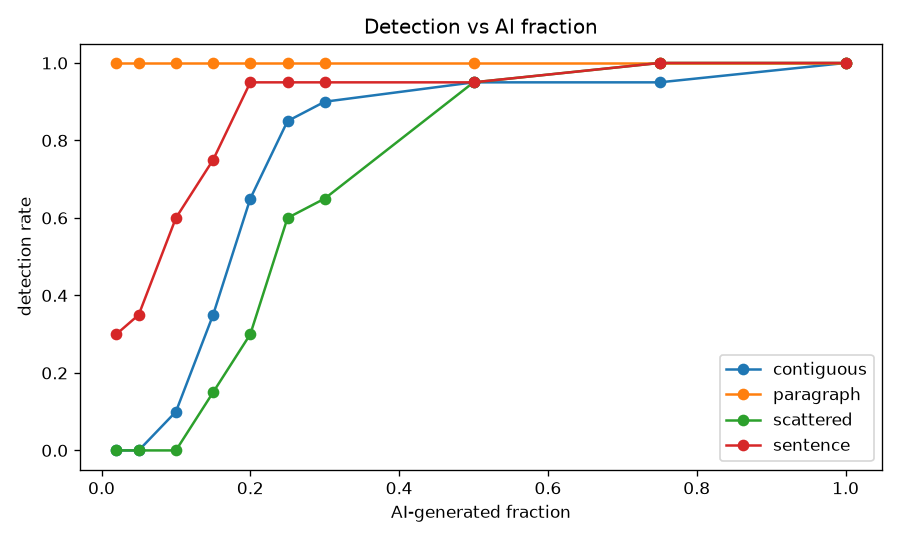
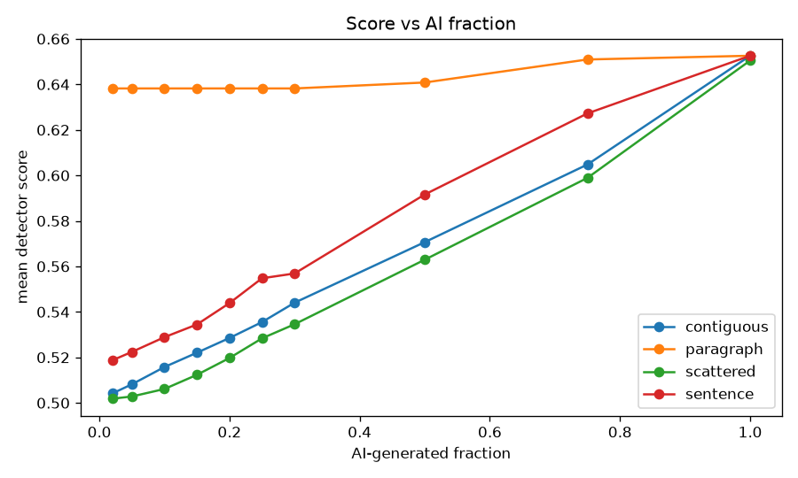
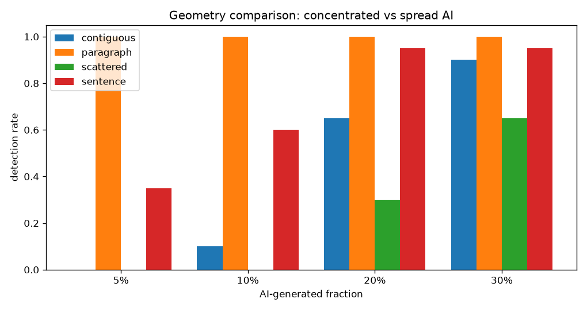
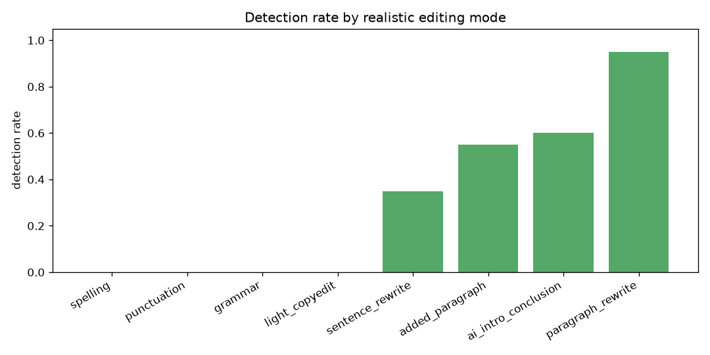
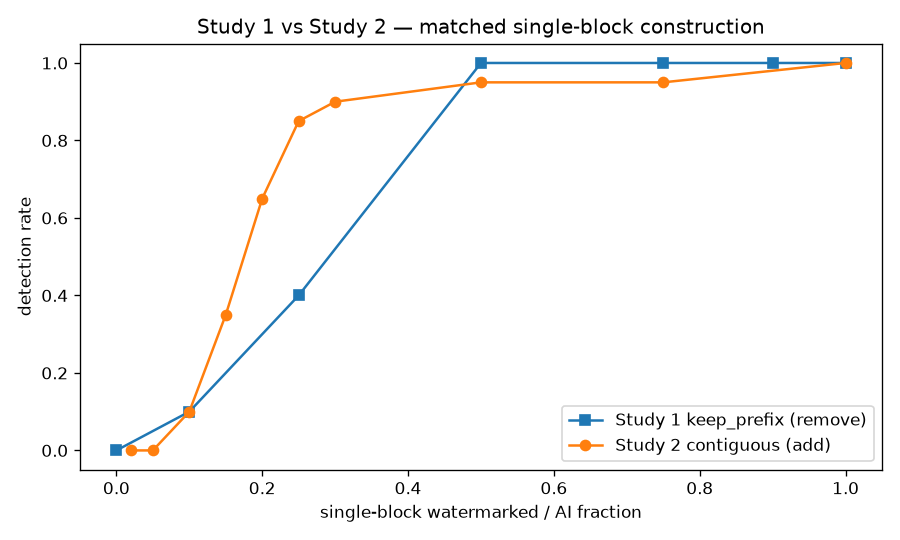

# Inverse SynthID-Text Study — AI-assisted human text

> Human public-domain prose progressively contaminated with genuine SynthID-watermarked AI spans, scored with our own local key and Study 1's Weighted-Mean detector. Characterises detectability; says **nothing** about Google's production secret key.

## Setup

- human samples: **20** (5 public-domain works)
- rows: **980** | detector threshold (reused methodology): **0.528**
- human baseline (0% AI): mean score 0.503, detection rate 0.000 (≈ false-positive floor)

## Headline answers (measured)

Detection rate at each AI-generated fraction, by geometry:

| AI frac | contiguous | paragraph | scattered | sentence |
|---|---|---|---|---|
| 2% | 0.00 | 1.00 | 0.00 | 0.30 |
| 5% | 0.00 | 1.00 | 0.00 | 0.35 |
| 10% | 0.10 | 1.00 | 0.00 | 0.60 |
| 20% | 0.65 | 1.00 | 0.30 | 0.95 |
| 30% | 0.90 | 1.00 | 0.65 | 0.95 |
| 50% | 0.95 | 1.00 | 0.95 | 0.95 |

> **Granularity caveat.** `sentence` and `paragraph` replace whole linguistic units, so their *actual* AI fraction is floor-limited by unit size and can far exceed the nominal target. On these short samples the `paragraph` geometry collapses to near-whole-document replacement (actual AI ≈ 0.91 even at 2% nominal) and is **not a valid fraction sweep** — read `contiguous`, `scattered`, and `sentence` (by *actual* fraction) as the informative results.

**AI fraction at which detection becomes common (rate ≥ 0.5), by *actual* AI fraction:**

- `contiguous`: actual AI ≈ **0.20** (nominal 20%)
- `paragraph`: actual AI ≈ **0.91** (nominal 2%) — _degenerate on these samples; see caveat_
- `scattered`: actual AI ≈ **0.25** (nominal 25%)
- `sentence`: actual AI ≈ **0.19** (nominal 10%)

## Axis 1 × 2 — AI fraction × geometry

### `contiguous`

| nominal AI frac | actual AI frac | mean score | detection rate | sem-sim vs orig | n |
|---|---|---|---|---|---|
| 0.02 | 0.020 | 0.504 | 0.00 | 1.000 | 20 |
| 0.05 | 0.051 | 0.508 | 0.00 | 1.000 | 20 |
| 0.10 | 0.101 | 0.516 | 0.10 | 1.000 | 20 |
| 0.15 | 0.149 | 0.522 | 0.35 | 1.000 | 20 |
| 0.20 | 0.199 | 0.529 | 0.65 | 1.000 | 20 |
| 0.25 | 0.250 | 0.536 | 0.85 | 0.999 | 20 |
| 0.30 | 0.301 | 0.544 | 0.90 | 0.999 | 20 |
| 0.50 | 0.500 | 0.571 | 0.95 | 0.998 | 20 |
| 0.75 | 0.750 | 0.605 | 0.95 | 0.992 | 20 |
| 1.00 | 1.000 | 0.653 | 1.00 | 0.986 | 20 |

### `paragraph`

| nominal AI frac | actual AI frac | mean score | detection rate | sem-sim vs orig | n |
|---|---|---|---|---|---|
| 0.02 | 0.913 | 0.638 | 1.00 | 0.987 | 20 |
| 0.05 | 0.913 | 0.638 | 1.00 | 0.987 | 20 |
| 0.10 | 0.913 | 0.638 | 1.00 | 0.987 | 20 |
| 0.15 | 0.913 | 0.638 | 1.00 | 0.987 | 20 |
| 0.20 | 0.913 | 0.638 | 1.00 | 0.987 | 20 |
| 0.25 | 0.913 | 0.638 | 1.00 | 0.987 | 20 |
| 0.30 | 0.913 | 0.638 | 1.00 | 0.987 | 20 |
| 0.50 | 0.931 | 0.641 | 1.00 | 0.987 | 20 |
| 0.75 | 0.990 | 0.651 | 1.00 | 0.986 | 20 |
| 1.00 | 1.000 | 0.653 | 1.00 | 0.986 | 20 |

### `scattered`

| nominal AI frac | actual AI frac | mean score | detection rate | sem-sim vs orig | n |
|---|---|---|---|---|---|
| 0.02 | 0.020 | 0.502 | 0.00 | 1.000 | 20 |
| 0.05 | 0.051 | 0.503 | 0.00 | 1.000 | 20 |
| 0.10 | 0.101 | 0.506 | 0.00 | 1.000 | 20 |
| 0.15 | 0.149 | 0.512 | 0.15 | 1.000 | 20 |
| 0.20 | 0.199 | 0.520 | 0.30 | 1.000 | 20 |
| 0.25 | 0.250 | 0.528 | 0.60 | 0.999 | 20 |
| 0.30 | 0.301 | 0.535 | 0.65 | 0.999 | 20 |
| 0.50 | 0.500 | 0.563 | 0.95 | 0.999 | 20 |
| 0.75 | 0.750 | 0.599 | 1.00 | 0.995 | 20 |
| 1.00 | 0.996 | 0.650 | 1.00 | 0.987 | 20 |

### `sentence`

| nominal AI frac | actual AI frac | mean score | detection rate | sem-sim vs orig | n |
|---|---|---|---|---|---|
| 0.02 | 0.113 | 0.519 | 0.30 | 1.000 | 20 |
| 0.05 | 0.135 | 0.522 | 0.35 | 1.000 | 20 |
| 0.10 | 0.193 | 0.529 | 0.60 | 0.999 | 20 |
| 0.15 | 0.226 | 0.534 | 0.75 | 0.999 | 20 |
| 0.20 | 0.294 | 0.544 | 0.95 | 0.999 | 20 |
| 0.25 | 0.371 | 0.555 | 0.95 | 0.999 | 20 |
| 0.30 | 0.388 | 0.557 | 0.95 | 0.999 | 20 |
| 0.50 | 0.604 | 0.592 | 0.95 | 0.997 | 20 |
| 0.75 | 0.835 | 0.627 | 1.00 | 0.988 | 20 |
| 1.00 | 1.000 | 0.653 | 1.00 | 0.986 | 20 |

## Axis 3 — Realistic editing modes

| mode | mean AI frac | mean score | detection rate | sem-sim vs orig | n |
|---|---|---|---|---|---|
| spelling | 0.020 | 0.502 | 0.00 | 1.000 | 20 |
| punctuation | 0.020 | 0.502 | 0.00 | 1.000 | 20 |
| grammar | 0.039 | 0.501 | 0.00 | 1.000 | 20 |
| light_copyedit | 0.079 | 0.501 | 0.00 | 1.000 | 20 |
| sentence_rewrite | 0.133 | 0.518 | 0.35 | 1.000 | 20 |
| added_paragraph | 0.165 | 0.528 | 0.55 | 1.000 | 20 |
| ai_intro_conclusion | 0.192 | 0.531 | 0.60 | 1.000 | 20 |
| paragraph_rewrite | 0.827 | 0.623 | 0.95 | 0.987 | 20 |

## Study 1 vs Study 2 — symmetry

Study 1 reached a given watermarked-token fraction by **removing** watermark from fully-watermarked text; Study 2 reaches it by **adding** watermarked spans to human text. To compare fairly we match the *construction*, not just the fraction: the comparable pair is a **single contiguous block** — Study 1 `keep_prefix` vs Study 2 `contiguous`.

| block fraction | Study 1 keep_prefix (remove) | Study 2 contiguous (add) |
|---|---|---|
| 0.00 | 0.00 | — |
| 0.02 | — | 0.00 |
| 0.05 | — | 0.00 |
| 0.10 | 0.10 | 0.10 |
| 0.15 | — | 0.35 |
| 0.20 | — | 0.65 |
| 0.25 | 0.40 | 0.85 |
| 0.30 | — | 0.90 |
| 0.50 | 1.00 | 0.95 |
| 0.75 | 1.00 | 0.95 |
| 0.90 | 1.00 | — |
| 1.00 | 1.00 | 1.00 |

**Verdict: broadly symmetric.** For the matched single-block construction the two curves track each other (mean |Δ detection| = 0.11 over shared fractions). This is the expected result: the Weighted-Mean statistic depends on the *count of watermarked tokens whose generation-time context is preserved*, not on whether you arrived there by adding or removing — essentially **history-independent**.

> The two studies' `scattered` conditions are **not** directly comparable: Study 1 scatters *individual isolated tokens* (which strips almost all signal — each watermarked token loses its generation context), whereas Study 2 scatters *k contiguous blocks* (which preserve context inside each block). That difference — geometry/granularity of the AI region, not history — is what drives detectability, and is the main lesson of the pair of studies.

## Limitations

- `distilgpt2` vehicle, not Gemini; our local key, **not** Google's production key.
- Weighted-Mean (tuning-free) detector.
- AI spans are genuine watermarked generations spliced into human text; light-edit modes approximate touch density with real generated micro-spans.
- 20 samples, English, single small model.
