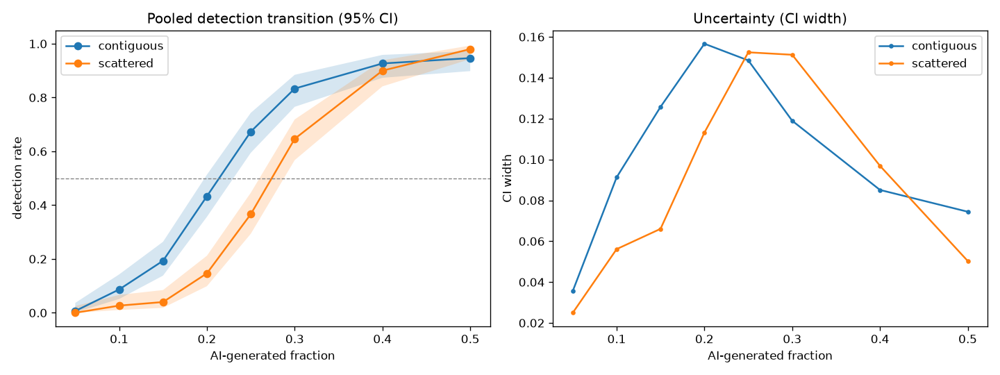
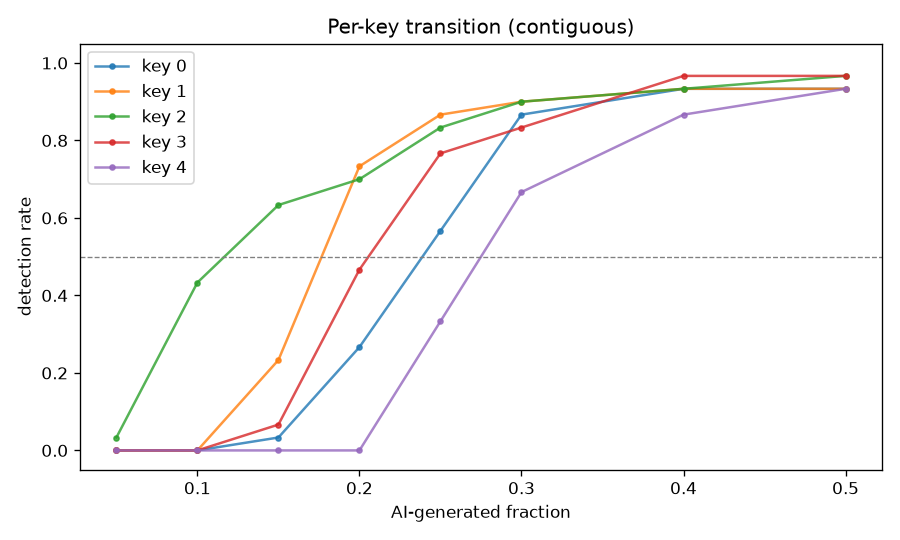
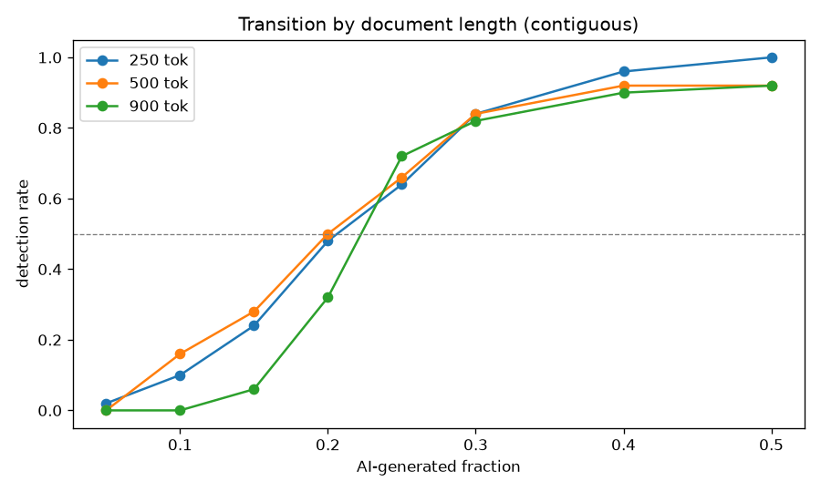

# SynthID-Text Detection Transition — Replication / Robustness

> Robustness check of Study 2's ~20-30% transition across **5 keys × 5 seeds × 3 document lengths**. Tuning-free Weighted-Mean detector, per-key 1% FPR threshold, our own local keys. Says nothing about Google's production secret key.

## Setup

- rows: **2430** | keys: **5** | seeds/condition: **5** | lengths: **[250, 500, 900]** tokens
- human baseline (0% AI) detection: **0.000** [0.000, 0.114] (n=30) — the false-positive floor.

## Pooled transition (all keys/seeds/lengths)

### `contiguous`

| AI frac | detection rate | 95% CI | n |
|---|---|---|---|
| 5% | 0.01 | [0.00, 0.04] | 150 |
| 10% | 0.09 | [0.05, 0.14] | 150 |
| 15% | 0.19 | [0.14, 0.26] | 150 |
| 20% | 0.43 | [0.36, 0.51] | 150 |
| 25% | 0.67 | [0.59, 0.74] | 150 |
| 30% | 0.83 | [0.77, 0.88] | 150 |
| 40% | 0.93 | [0.87, 0.96] | 150 |
| 50% | 0.95 | [0.90, 0.97] | 150 |

**Crossings:** 25%→0.16, 50%→0.21, 75%→0.27, 90%→0.37 (AI fraction).

### `scattered`

| AI frac | detection rate | 95% CI | n |
|---|---|---|---|
| 5% | 0.00 | [0.00, 0.02] | 150 |
| 10% | 0.03 | [0.01, 0.07] | 150 |
| 15% | 0.04 | [0.02, 0.08] | 150 |
| 20% | 0.15 | [0.10, 0.21] | 150 |
| 25% | 0.37 | [0.29, 0.45] | 150 |
| 30% | 0.65 | [0.57, 0.72] | 150 |
| 40% | 0.90 | [0.84, 0.94] | 150 |
| 50% | 0.98 | [0.94, 0.99] | 150 |

**Crossings:** 25%→0.22, 50%→0.27, 75%→0.34, 90%→0.40 (AI fraction).

## Variability across the 5 keys

Per-key 50% crossing (AI fraction), by geometry:

| geometry | key 0 | key 1 | key 2 | key 3 | key 4 | spread |
|---|---|---|---|---|---|---|
| contiguous | 0.24 | 0.18 | 0.12 | 0.21 | 0.28 | 0.12–0.28 |
| scattered | 0.30 | 0.26 | 0.19 | 0.26 | 0.34 | 0.19–0.34 |

## Variability across document length

Detection rate by length at key AI fractions (`contiguous`):

| length | 10% | 20% | 30% | 50% | 50% crossing |
|---|---|---|---|---|---|
| 250 | 0.10 | 0.48 | 0.84 | 1.00 | 0.21 |
| 500 | 0.16 | 0.50 | 0.84 | 0.92 | 0.20 |
| 900 | 0.00 | 0.32 | 0.82 | 0.92 | 0.22 |

## Variability across generation seeds

Per-seed 50% crossing (contiguous) ranges **0.21–0.22** across 5 seeds (spread 0.01).

## Contiguous vs scattered

Through the transition region (≤40% AI) contiguous detection is always ≥ scattered (max gap 0.31 in the steep part). The two **converge at saturation**: at 50% AI, contiguous 0.95 vs scattered 0.98 — within overlapping CIs. So one concentrated AI block is more detectable than the same fraction split into blocks *while detection is still rising*, not once both saturate.

## Answers

1. **0–10% region stays mostly undetected?** contiguous detection at 10% = 0.09; the 0–10% band sits near the false-positive floor.
2. **Crossings (contiguous):** 25%→0.16, 50%→0.21, 75%→0.27, 90%→0.37 AI fraction.
3. **Across keys:** 50% crossing spans 0.12–0.28 AI fraction.
4. **Across lengths:** see table above (50% crossing per bucket).
5. **Generation randomness (seeds):** 50% crossing spread 0.01.
6. **Contiguous > scattered consistently?** Through the transition (≤40% AI) yes (max gap 0.31); at 50% saturation they converge within overlapping CIs.
7. **~20-30% transition reproducible?** Yes, in shape and order of magnitude: detection sits near the floor at ≤10% AI and rises steeply to a majority in the ~15-25% region. The 50% crossing is 0.21 (contiguous) / 0.27 (scattered); the 75% ('commonly detected') crossing is 0.27 / 0.34, overlapping Study 2's ~20-30% band. The midpoint sits at the low end of that band under this larger 5-key × 5-seed sample.

## Limitations

- `distilgpt2` vehicle (1024-token context ⇒ 2000-token bucket not tested); our own local keys, **not** Google's production key.
- Tuning-free Weighted-Mean detector, deliberately unchanged.
- Per-key 1% FPR thresholds are estimated from clean controls; too few controls inflates key-to-key threshold variance (an early 16-sample run produced one spuriously high per-key threshold — fixed by estimating the tail from more samples, which is correct estimation, not detector tuning).
- 2 human samples/bucket; scattered = 5 contiguous blocks (as in Study 2).
