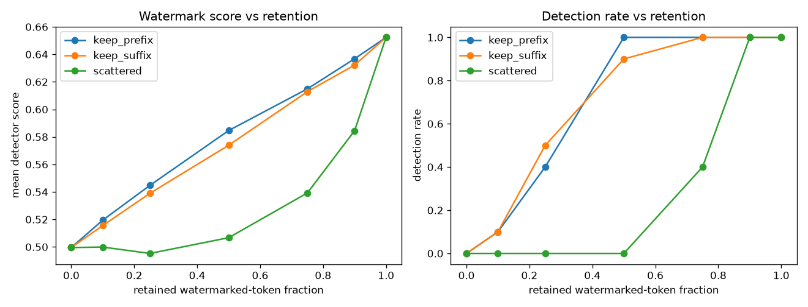
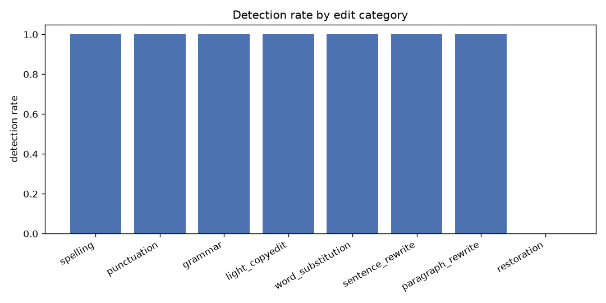

# SynthID-Text Behaviour Study — Results

> Produced with **our own local watermark key** on a small open model (`distilgpt2`). These numbers characterise the SynthID-Text *mechanism* and say **nothing** about Google's production detector, whose key we do not hold.

**Headline (local implementation):** under the tuning-free Weighted-Mean detector, watermark detection becomes unreliable (<50%) once the retained watermarked-token fraction drops to about **0.75** (worst-case geometry `scattered`).

## Run configuration

- rows: **310**
- language: en
- decision threshold (calibrated): 0.539
- prompts × replicates: 10 × 1

## Baselines

| condition | mean score | detected rate | n |
|---|---|---|---|
| reference | 0.500 | 0.000 | 10 |
| watermarked | 0.652 | 1.000 | 10 |

## Axis 1 — Watermarked-token retention vs detection

### geometry: `keep_prefix`

| retained watermarked frac | mean score | detection rate | mean sem-sim vs original | n |
|---|---|---|---|---|
| 1.00 | 0.652 | 1.000 | 0.988 | 10 |
| 0.90 | 0.637 | 1.000 | 0.989 | 10 |
| 0.75 | 0.615 | 1.000 | 0.992 | 10 |
| 0.50 | 0.585 | 1.000 | 0.996 | 10 |
| 0.25 | 0.545 | 0.400 | 0.993 | 10 |
| 0.10 | 0.519 | 0.100 | 1.000 | 10 |
| 0.00 | 0.500 | 0.000 | 1.000 | 10 |

**Detection degrades** (rate < 0.5) at retained watermarked fraction ≈ **0.25** for `keep_prefix`.

### geometry: `keep_suffix`

| retained watermarked frac | mean score | detection rate | mean sem-sim vs original | n |
|---|---|---|---|---|
| 1.00 | 0.652 | 1.000 | 0.988 | 10 |
| 0.90 | 0.632 | 1.000 | 0.988 | 10 |
| 0.75 | 0.613 | 1.000 | 0.988 | 10 |
| 0.50 | 0.574 | 0.900 | 0.992 | 10 |
| 0.25 | 0.539 | 0.500 | 0.997 | 10 |
| 0.10 | 0.516 | 0.100 | 0.999 | 10 |
| 0.00 | 0.500 | 0.000 | 1.000 | 10 |

**Detection degrades** (rate < 0.5) at retained watermarked fraction ≈ **0.10** for `keep_suffix`.

### geometry: `scattered`

| retained watermarked frac | mean score | detection rate | mean sem-sim vs original | n |
|---|---|---|---|---|
| 1.00 | 0.652 | 1.000 | 0.988 | 10 |
| 0.90 | 0.584 | 1.000 | 0.988 | 10 |
| 0.75 | 0.539 | 0.400 | 0.987 | 10 |
| 0.50 | 0.507 | 0.000 | 0.987 | 10 |
| 0.25 | 0.495 | 0.000 | 0.990 | 10 |
| 0.10 | 0.500 | 0.000 | 0.994 | 10 |
| 0.00 | 0.500 | 0.000 | 1.000 | 10 |

**Detection degrades** (rate < 0.5) at retained watermarked fraction ≈ **0.75** for `scattered`.

## Axis 2 — Detection by edit category

| edit category | mean tokens changed frac | mean score | detection rate | mean sem-sim vs original | n |
|---|---|---|---|---|---|
| spelling | 0.031 | 0.630 | 1.000 | 0.987 | 10 |
| punctuation | 0.039 | 0.625 | 1.000 | 0.987 | 10 |
| grammar | 0.062 | 0.611 | 1.000 | 0.986 | 10 |
| light_copyedit | 0.102 | 0.583 | 1.000 | 0.984 | 10 |
| word_substitution | 0.148 | 0.571 | 1.000 | 0.985 | 10 |
| sentence_rewrite | 0.203 | 0.619 | 1.000 | 0.986 | 10 |
| paragraph_rewrite | 0.500 | 0.573 | 1.000 | 0.980 | 10 |
| restoration | 0.977 | 0.500 | 0.000 | 1.000 | 10 |

## Limitations

- `distilgpt2` is a *vehicle* for the watermark mechanism, not Gemini; absolute scores are implementation-specific.
- Weighted-Mean (tuning-free) detector, not the trained Bayesian one.
- Our own local key; **not** Google's production key.
- Edit categories are perturbation *profiles*, not real linguistic edits (see README / edits.py).
- English-only; single small model; modest prompt count.
